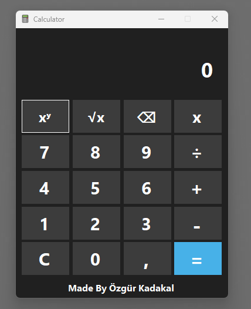

# 🧮 Calculator App | Hesap Makinesi Uygulaması  

### - Developed by Özgür Kadakal

---

⚠️ **Önemli:** İndirdiğiniz `.zip` dosyasını çıkartarak projeyi bu şekilde açınız. Aksi halde uygulama düzgün çalışmayabilir.

⚠️ **Important:** Please extract the downloaded `.zip` file before opening the project. Otherwise, the application may not work properly.

---

## 🖼️ Uygulama Ön İzlemesi | App Preview  
📸 Uygulama Arayüzü

### 🖼️ Interface Screenshot 1  

---

## 🌍 English

### 🧮 Calculator App  
A simple and functional calculator application developed using **C# and Windows Forms** by **Özgür Kadakal**.

### ✨ Features  
- ➕ Basic operations: addition, subtraction, multiplication, and division  
- 🧮 Power and square root calculations  
- 🔢 Support for decimal numbers  
- 🎨 Clean and user-friendly interface  
- 🖱️ Mouse-only control (no keyboard shortcuts)  
- 💻 Developed from scratch by Özgür Kadakal

---

## 🇹🇷 Türkçe

### 🧮 Hesap Makinesi  
**C# ve Windows Forms** kullanılarak **Özgür Kadakal** tarafından geliştirilmiş basit ve işlevsel bir hesap makinesi uygulamasıdır.

### ✨ Özellikler  
- ➕ Temel işlemler: toplama, çıkarma, çarpma ve bölme  
- 🧮 Üs alma ve karekök hesaplama  
- 🔢 Virgüllü sayılarla işlem yapabilme  
- 🎨 Temiz ve kullanıcı dostu arayüz  
- 🖱️ Sadece fare ile kontrol (klavye desteği yoktur)  
- 💻 Sıfırdan Özgür Kadakal tarafından geliştirilmiştir

---

## 📬 Contact | İletişim

For any feedback, questions, or suggestions, feel free to contact me:  
📧 **ozgurkadakal61@gmail.com**

---

